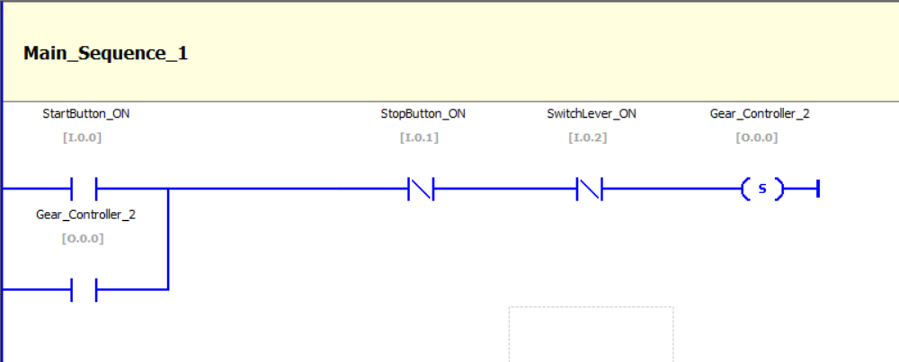
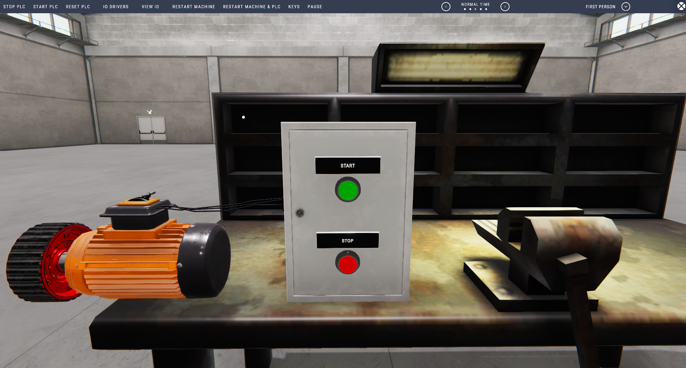

# 🛠️ Ladder Logic: Start/Stop Motor Control with Seal-In Circuit

This project demonstrates a basic **motor control sequence** using ladder logic. The control logic includes:

- A **Start button** to energize the motor
- A **Stop button** to de-energize it
- A **seal-in (latching)** circuit to keep the motor running after the Start button is released

## 🧰 Tools Used

- **Virtual PLC CPU** (as provided by the simulation software)
- **Machine Simulator** (such as Nirtec's Machine Simulator or equivalent) to simulate physical I/O
- **Ladder Logic Programming Environment** (e.g., integrated into Machine Simulator)

---

## 📋 Project Objectives

- Implement a latching circuit using a parallel branch
- Properly incorporate Stop button logic to break the latch
- Simulate start/stop conditions for a motor (e.g., `Gear_Controller_2`)
- Debug a common mistake where the motor fails to stop

---

## 🧑‍💻 Ladder Logic Diagram

Here's the implemented logic with a corrected latching configuration:

> ⚠️ The issue: In the original version, the seal-in bypassed the Stop button.
>
> ✅ The fix: Place the Stop button in series with both Start and the seal-in branch.

---

## 🖥️ Software Environment

Screenshot of the Machine Simulator with virtual PLC CPU in use:

---

## 🛠️ Setup Instructions

1. **Install Machine Simulator**  
   Download and install the simulator of your choice (e.g., Nirtec Machine Simulator).

2. **Create a New Project**  
   - Define a virtual PLC with appropriate I/O addresses.
   - Use a `Main_Sequence` routine to create your logic.

3. **Configure I/O**  
   - Assign inputs:
     - `I.0.0` → Start Button
     - `I.0.1` → Stop Button
     - `I.0.2` → Switch Lever (optional safety or pre-condition)
   - Assign output:
     - `Q.0.0` → Motor (e.g., `Gear_Controller_2`)

4. **Deploy & Simulate**
   - Download the program to the virtual PLC CPU.
   - Press the Start button to engage the motor.
   - Press the Stop button to halt operation and break the seal-in.

---

## ✅ Outcome

This project serves as a foundation for understanding:

- Seal-in/latching logic
- Start/Stop safety protocols
- Debugging ladder diagrams using simulation tools

---

## 📎 License

This project is for educational purposes.

---

## 🙋‍♂️ Author

Benjamin Kaliope  
Sophomore Computer Engineering Student  
University of South Carolina
